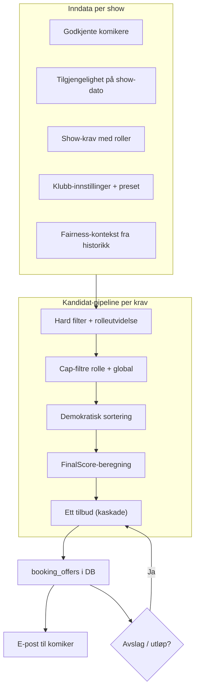
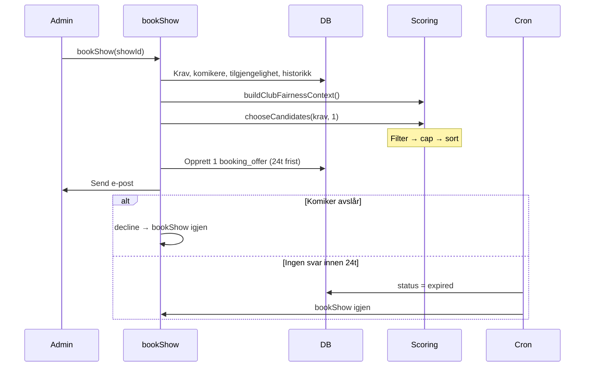
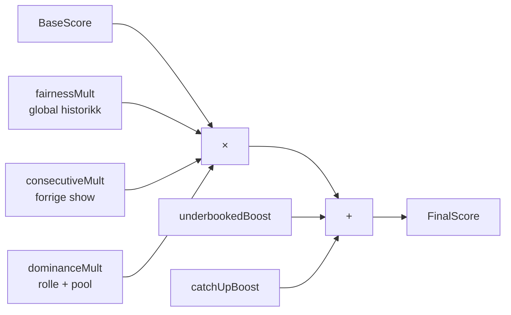
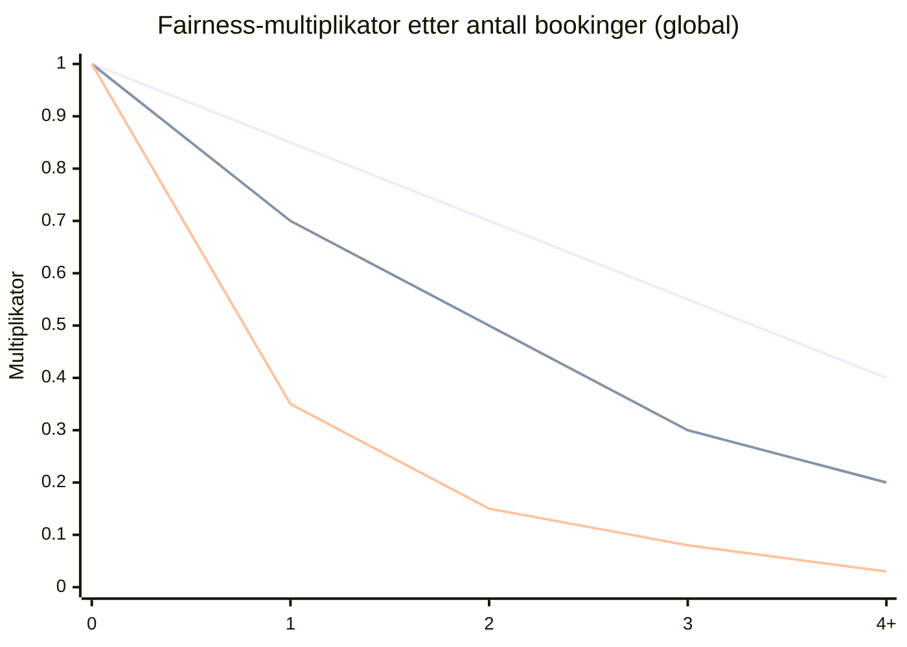
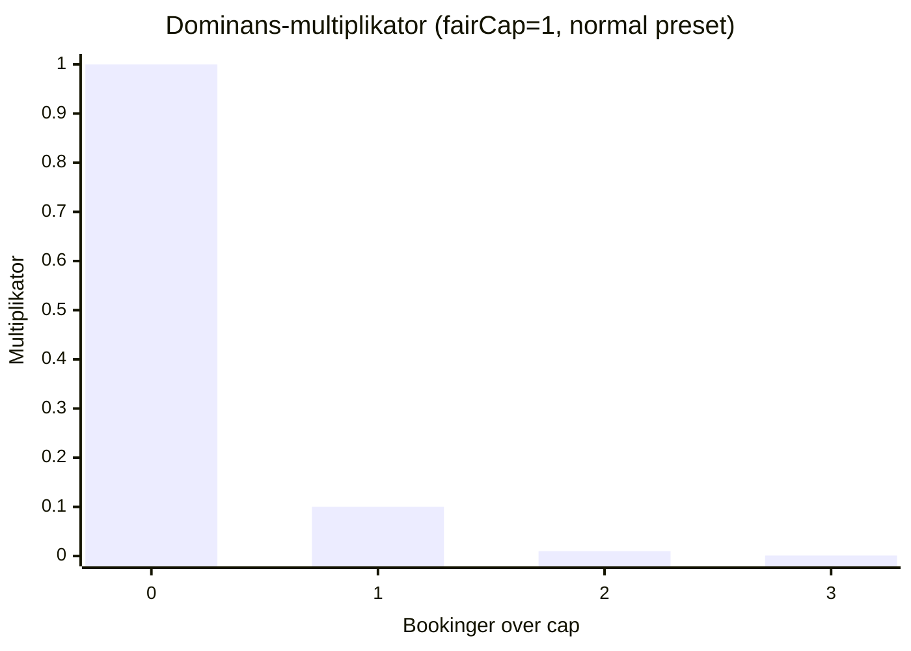
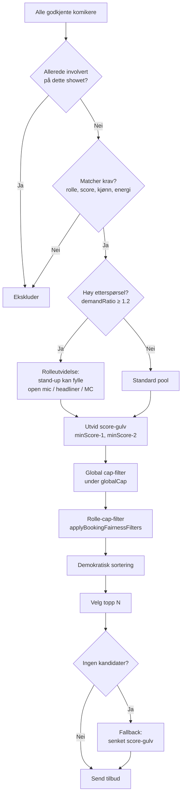
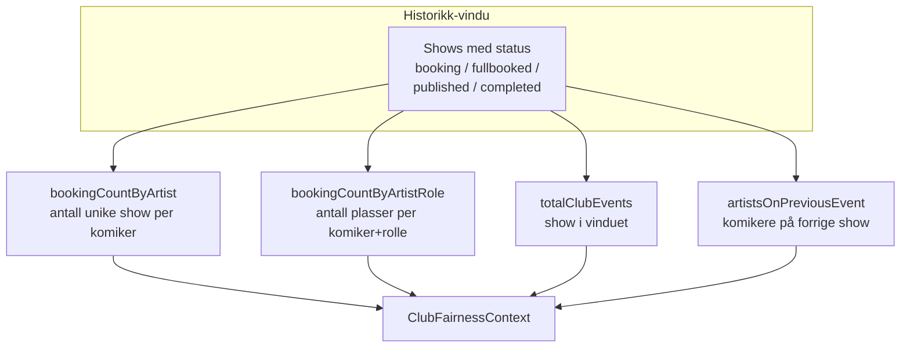
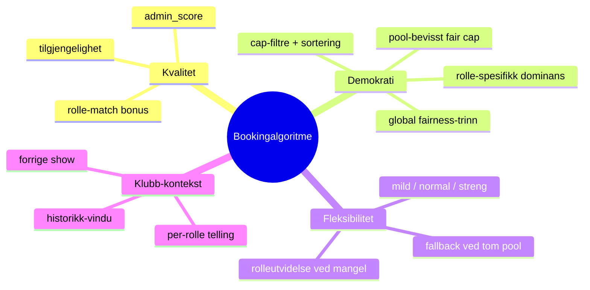

# Bookingalgoritmen i Humor.events

Dette dokumentet beskriver hvordan autobooking fungerer per i dag — fra `bookShow()` til endelig score. Algoritmen ligger primært i `lib/booking-scoring.ts` og `lib/actions/booking.ts`, med klubbspesifikke innstillinger i `club_booking_settings`.

---

## Overblikk

Når et show har status **booking**, kjører `bookShow()` for hvert ubesatt krav (lineup-plass):

1. Hent godkjente komikere, tilgjengelighet og historikk
2. Filtrer kandidater (rolle, score, allerede booket på showet)
3. Score og ranger kandidater
4. Send **ett** bookingtilbud om gangen til beste kandidat (kaskade)

Målet er å balancere **kvalitet** (admin-score, tilgjengelighet) mot **demokratisk fordeling** (rotering, fair share per rolle, sesonghistorikk).



---

## Flyt: `bookShow()` — kaskade

Booking rangerer **alle kvalifiserte kandidater med en gang**, men sender **ett tilbud om gangen** per ledig spot. Neste tilbud sendes ved avslag (umiddelbart) eller utløp (cron hver time).



**Prioritet mellom roller** (hvem som får tilbud først når flere krav mangler dekning):

| Prioritet | Rolle        |
|----------:|--------------|
| 0         | Konferansier |
| 1         | Headliner    |
| 2         | Stand-up     |
| 3         | Open mic     |

**Regler per show:**
- Maks **`offers_per_wave` aktive tilbud** (`status = sent`) per krav om gangen (standard 1; håndheves i app-kode)
- Én komiker kan maks ha **ett tilbud** per show (inkl. avslått/utløpt)
- `offers_per_wave` = antall tilbud som sendes **samtidig** per ledig plass hver gang algoritmen kjører
- `offers_per_slot` = maks antall tilbuds forsøk per ledig plass **over tid** (avslått og utløpt teller)
- Autobooking-tilbud utløper etter **24 timer**; cron (`/api/cron/expire-offers`) kaskaderer videre
- Manuelle krav (`booking_mode: manual`) hoppes over
- Admin ser aktivt tilbud + historikk (avslått/utløpt) under Lineup

---

## Scoring-modellen

### BaseScore — kvalitet og match

```
BaseScore = quality + availability + roleMatch
```

| Komponent     | Formel                                      | Standard |
|---------------|---------------------------------------------|----------|
| **quality**   | `(admin_score / 10) × quality_weight`       | weight 100 |
| **availability** | `availability_bonus` hvis markert ledig | bonus 30 |
| **roleMatch** | `role_match_bonus` hvis dedikert rolle      | bonus 15 |

**Eksempel:** Score 8, tilgjengelig, dedikert stand-up:
`80 + 30 + 15 = 125`

---

### FinalScore — full formel

Når pool-kontekst finnes (produksjon og simulering):

```
FinalScore = BaseScore × fairnessMult × consecutiveMult × dominanceMult
           + underbookedBoost + catchUpBoost
```



| Faktor | Basert på | Effekt |
|--------|-----------|--------|
| **fairnessMult** | Antall **show** booket i historikk-vindu (global) | Senker score for ofte-bookede |
| **consecutiveMult** | Var på **forrige** klubbshow | Straffer back-to-back |
| **dominanceMult** | Antall bookinger **i denne rollen** vs. pool-størrelse | Straffer rolle-dominans |
| **underbookedBoost** | 0 bookinger i rollen + høy etterspørsel | Flat bonus til ubookede |
| **catchUpBoost** | Klubb med importert historikk | Jevner ut sesongfordeling |

---

## Fairness-presets (Mild / Normal / Streng)

Klubber velger preset i admin (`club-booking-settings-form.tsx`). Preset styrer trinnvis nedprioritering og dominansstraff.

### Trinnvis fairness-multiplikator (global show-telling)

Gjelder antall **unike show** komikeren har vært booket på i historikk-vinduet (typisk 12 mnd).

| Bookinger | Mild | Normal | Streng |
|----------:|-----:|-------:|-------:|
| 0         | 1.00 | 1.00   | 1.00   |
| 1         | 0.85 | 0.70   | 0.35   |
| 2         | 0.70 | 0.50   | 0.15   |
| 3         | 0.55 | 0.30   | 0.08   |
| 4+        | 0.40 | 0.20   | 0.03   |



**Tolkning:**
- **Mild** — kvalitet kan fortsatt vinne ofte; moderat rotasjon
- **Normal** — balanse (standardverdier)
- **Streng** — kraftig rotasjon; erfarne komikere nedprioriteres raskt

### Consecutive-straff (forrige show)

| Preset | Multiplikator hvis booket forrige klubbshow |
|--------|---------------------------------------------|
| Mild   | 0.30 |
| Normal | 0.10 |
| Streng | 0.02 |

---

## Pool-bevisst dominans

Dette laget løser nisje-problemer: få open mic-komikere, mange open mic-plasser over sesongen.

### Fair share cap per rolle

```
demandRatio = totalClubEvents / eligiblePoolSize

fairCap = 1                    hvis demandRatio ≥ 3
        = max(1, floor(events/pool) - 1)  hvis demandRatio ≥ 2
        = max(1, floor(events/pool))      ellers
```

**Eksempel:** 22 show i vinduet, 4 dedikerte open mic-komikere:
- `demandRatio = 5.5` → `fairCap = 1`
- Etter 1 open mic-booking i rollen: dominansstraff slår inn

### Dominans-multiplikator

Når `roleBookingCount ≥ fairCap`:

```
excess = roleBookingCount - fairCap + 1
dominanceMult = DOMINANCE_BASE[preset] ^ excess
```

| Preset | DOMINANCE_BASE | Effekt ved 1 over cap |
|--------|---------------:|----------------------|
| Streng | 0.05           | ×0.05 (nesten utestengt) |
| Normal | 0.10           | ×0.10 |
| Mild   | 0.40           | ×0.40 (mykere) |



### Underbooked-boost

Gis kun når:
- Komikeren har **0** bookinger **i denne rollen**
- `totalClubEvents > eligiblePoolSize` (etterspørsel > tilbud)

| Preset | Boost (additiv) |
|--------|----------------:|
| Streng | 35 |
| Normal | 24 |
| Mild   | 8 |

---

## Kandidatfiltrering og sortering



### Rolleutvidelse ved høy etterspørsel

Når `demandRatio ≥ 1.2` **eller** dedikert pool ≤ 3:

| Krav       | Utvidet pool                          |
|------------|---------------------------------------|
| Open mic   | + stand-up-komikere (med min. score)  |
| Headliner  | + stand-up med høy nok score          |
| Konferansier | + stand-up                          |

Dette speiler praksis der klubber bruker stand-up-komikere i nisjeplasser når få er merket med den rollen.

### Cap-filtre

**Rolle-cap:** Prioriterer komikere under `fairCap` for rollen. Hvis alle er over cap → velg de med **lavest** rolle-telling.

**Global cap:**
```
scale = max(6, round(√rosterSize))
globalCap = max(3, ceil(totalClubEvents / scale))
            → minst 4 når totalClubEvents ≥ 10
```

Forhindrer at én komiker samler for mange plasser totalt i sesongen.

### Sorteringsrekkefølge

1. **Lavest global** booking-telling (færrest show booket totalt)
2. **Lavest rolle**-spesifikk telling
3. Ved lik telling og allerede booket: **lavere** admin-score (jevnere rotasjon)
4. **Høyest FinalScore** som tiebreaker

---

## Fairness-kontekst fra databasen

`buildClubFairnessContext()` bygger historikk ved hvert `bookShow`-kall:



**Kilder:**
- `confirmed_spots` (status: confirmed, completed, paid)
- `show_requirements.role_name` for rolle-spesifikk telling
- Forrige show = nærmeste tidligere show kronologisk

---

## Catch-up for klubber med historikk

Aktiveres når klubben har et typisk «importert» historikk-mønster:
- Minst 3 komikere med ≥ 2 bookinger
- Minst én med ≥ 4 bookinger

Gir **additiv boost** til komikere med 1–3 bookinger (ikke 0, ikke 4+), for å jevne sesongfordeling når noen allerede ligger foran.

| Global bookinger | Catch-up boost |
|-----------------:|-------------:|
| 1                | 28           |
| 2                | 56           |
| 3                | 40           |

---

## Konfigurerbare parametre

Lagres per klubb i `club_booking_settings` (se migrasjon `027_club_booking_settings.sql`).

| Parameter | Betydning | Standard |
|-----------|-----------|----------|
| `fairness_window_months` | Måneder historikk | 12 |
| `fairness_multiplier_1..4_plus` | Trinnvis straff | se preset |
| `consecutive_event_multiplier` | Forrige-show-straff | 0.10 |
| `quality_weight` | Vekt på admin-score | 100 |
| `availability_bonus` | Bonus for tilgjengelig | 30 |
| `role_match_bonus` | Bonus for dedikert rolle | 15 |
| `offers_per_wave` | Tilbud per utsendelse (samtidige aktive tilbud per ledig plass) | 1 |
| `offers_per_slot` | Maks tilbudsforsøk per ledig plass (kaskade over tid) | 10 |
| `fallback_limit` | Maks fallback-kandidater | 5 |
| `min_bookable_score` | Absolutt score-gulv | 6 |

---

## Eksempel: Open mic-plass, normal preset

**Scenario:** Klubb med 20 show i vinduet, 5 dedikerte open mic-komikere. Komiker A har 1 open mic-booking, score 9, tilgjengelig. Komiker B har 0, score 7, tilgjengelig (stand-up, utvidet pool).

| Steg | A | B |
|------|---|---|
| BaseScore | 90+30+15=135 | 70+30+0=100 |
| fairnessMult (global 2 vs 0) | ×0.50 | ×1.00 |
| dominanceMult (rolle 1 vs 0, cap=1) | ×0.10 | ×1.00 |
| underbookedBoost | 0 | +24 |
| **FinalScore** | ≈ 6.8 | ≈ **124** |

→ B prioriteres — demokratisk rotasjon vinner over ren kvalitet.

---

## Eksempel: Streng preset, erfaren komiker

Komiker med 4 show i historikk, score 10, booket forrige show, open mic-rolle med cap nådd:

```
BaseScore = 100 + 30 + 15 = 145
× fairnessMult(4+) = 0.03
× consecutiveMult  = 0.02
× dominanceMult    = 0.05
≈ 0.04  (+ eventuelle boosts)
```

→ Nesten aldri valgt; klubben tvinges til å rotere.

---

## Hva algoritmen ikke gjør

| Aspekt | Dagens oppførsel |
|--------|------------------|
| **Tilbudssvar** | Sender tilbud; hvem som aksepterer håndteres separat |
| **Manuelle plasser** | `booking_mode: manual` — ingen autobooking |
| **Geografi / reise** | Ikke med i score |
| **Genre / stil** | Kun via admin-score og energinivå |
| **Garanti om lik fordeling** | Probabilistisk fairness, ikke hard kvote |

---

## Relevante filer

| Fil | Innhold |
|-----|---------|
| `lib/booking-scoring.ts` | Scoring, presets, cap, dominans, filtre |
| `lib/actions/booking.ts` | `bookShow()`, kandidatvalg, tilbud |
| `lib/club-booking-settings.ts` | Laster innstillinger + fairness-kontekst |
| `lib/booking-test-helpers.ts` | Simulering (speiler produksjon) |
| `lib/booking-democracy.test.ts` | 100 sesong-scenarier (regresjonstest) |
| `components/admin/club-booking-settings-form.tsx` | Admin UI for preset |

---

## Oppsummert designfilosofi



Algoritmen er bevisst **lagdelt**: kvalitet gir base, fairness-modifikatorer og cap-filtre sørger for rotasjon — spesielt i pressede roller som open mic og headliner. Preset lar klubben velge hvor aggressiv denne rotasjonen skal være.
